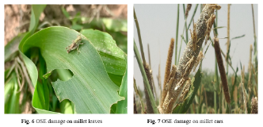

```{r setup}
#| include: false
source(here::here("R", "_common.R"))

# Load required libraries
library(tidyverse)
library(mgcv)
library(glmmTMB) 
library(emmeans)
library(gratia)
library(broom)
library(broom.mixed)
library(knitr)
library(MetBrewer)

# Load processed data
data <- read_csv(here("data", "processed", "ose_data_processed.csv"))

# Prepare data for modeling
data <- data |>
  mutate(
    farmer = factor(farmer),
    mission_number = factor(mission_number),
    fertilizer_treatment = factor(fertilizer_treatment, levels = c("control", "fertilized")),
    region = factor(region),
    # Convert damage from percentage to proportion for consistency
    ose_damage_percent = ose_damage_percent / 100
  ) |>
  filter(!is.na(ose_count), !is.na(fertilizer_treatment))

# Helper function to format p-values for inline reporting
format_p <- function(p, threshold = 0.001) {
  if (p < threshold) {
    return("< 0.001")
  } else {
    return(paste0("= ", round(p, 3)))
  }
}
```


```{r ose-density-models}
#| echo: false
#| message: false
#| warning: false

# Split data into a list of data based on mission date
model_data <- data |>
    group_split(mission_number)

# Create lists to store objects
mission_mods_density <- list()
mission_emmeans_density <- list()

# Loop through missions: create model and emmeans with caching
for (i in seq_along(model_data)){
    # Cache each mission model separately
    mission_mods_density[[i]] <- cache_model(
        model_name = paste0("locust_density_mission_", i),
        data = model_data[[i]],
        fit_function = create_count_glmm_model
    )
    
    mission_emmeans_density[[i]] <- get_emmeans_and_pairs(mission_mods_density[[i]], mission_num = i)
}

names(mission_mods_density) <- c('m1', 'm2', 'm3')
names(mission_emmeans_density) <- c('m1', 'm2', 'm3')
```

```{r ose-damage-models}
#| echo: false
#| message: false
#| warning: false

# Prepare data with scaled damage
data_damage <- data |>
  mutate(ose_damage_percent = ose_damage_percent / 100)

# Split data into a list of data based on mission date
model_data_damage <- data_damage |>
    group_split(mission_number)

# Create lists to store objects
mission_mods_damage <- list()
mission_emmeans_damage <- list()

# Loop through missions: create model and emmeans with caching
for (i in seq_along(model_data_damage)){
    # Cache each mission model separately
    mission_mods_damage[[i]] <- cache_model(
        model_name = paste0("locust_damage_mission_", i),
        data = model_data_damage[[i]],
        fit_function = create_damage_glmm_model
    )
    
    mission_emmeans_damage[[i]] <- get_emmeans_and_pairs(mission_mods_damage[[i]], mission_num = i)
}

names(mission_mods_damage) <- c('m1', 'm2', 'm3')
names(mission_emmeans_damage) <- c('m1', 'm2', 'm3')
```

# Statistical analyses

## General statistical and programatic approach

All statistics were conducted in `{r} R.version.string` (R Core Team, 2024) using generalized additive mixed models (GAMMs) and generalized linear mixed models (GLMMs) implemented with `mgcv` [@wood2017generalized; @wood2011fast; @wood2004stable] and `glmmTMB` [@brooks2017glmmtmb; @mcgillycuddy2025parsimoniously] packages, respectively. Models were appriased/validated using `DHARMa` [@hartig2024dharma] and `gratia` [@simpson2024gratia]. Model selection when needed was done using AIC. Estimated marginal means and pairwise comparisons were calculated using the `emmeans` package [@lenth2025emmeans]. Data visualization was performed using the `ggplot2` package [@wickham2016ggplot2] along with extensions from the `tidyverse` suite of packages [@wickham2019tidyverse]. All code and data are versioned on github at: [github.com/ddlawton/OSE-Range-Analysis](https://github.com/ddlawton/OSE-Range-Analysis). Upon publication a github archive snapshot will be created and stored in Zenodo for reproducibility with a DOI and citation.

## Overall and mean monthly maps generation

Maps of mean annual precipitation (MAP) and monthly rainfall patterns were generated using Climate Hazards Center Infrared Precipitation with Stations (CHIRPS) data [@funk2015climate] processed in Google Earth Engine [@gorelick2017google] and imported into `R` for visualization with the `terra` [@hijmans2025terra] and `tidyterra` [@hernangomez2023tidyterra] packages. Senegal administrative boundaries were obtained from the `Natural Earth` public domain map dataset using the `rnaturalearth` package [@massicotte2025rnaturalearth].

## Locust density and damage models

For both density and damage, separate models were created for each of the three survey missions to assess how effects changed over time relative to the timing of fertilizer application. We specified the models as generalized linear mixed models (GLMMs) with a Poisson family for density and a tweedie family for damage percent (scaled to proportion). In both cases, we included fertilizer treatment, region, and their interaction as fixed effects, and farmer as a random effect to account for repeated measures since each farmer has a control and fertilized field.

## Millet yield model

For millet yield, we specified a GLMM with a tweedie family to account for the continuous, positive, and right-skewed nature of yield data. Like the locust density and damage models, we included fertilizer treatment, region, and their interaction as fixed effects, and farmer as a random effect to account for repeated measures.

## Ground cover × fertilizer mediation of OSE density

To test whether the effect of fertilizer on grasshopper density is mediated by ground cover, we fit a unified generalized additive model (GAM) with a Tweedie family to account for overdispersed count data. The model included fertilizer treatment, mission number, their interaction, and region as fixed effects, a random effect for farmer, and, critically, a by-variable smooth term allowing the relationship between ground cover and OSE density to vary by fertilizer treatment. Constructing a unified model allowed as to look directly at the mediation effect of ground cover on the fertilizer treatment effect on OSE density while accounting for the main effects of fertilizer treamtment and mission number.

# Results

## Population dynamics

::: {tbl-dev-stages}

|            | Kaffrine                        | Thies                        | Fatick                       | Saint - Louis                |
|------------|---------------------------------|------------------------------|------------------------------|------------------------------|
| **Mission 1** | Jul. 27 - Aug. 3               |                              | Aug. 13 - 18                 | Aug. 15 - 20                 |
|            | G1 - 4th instar<br>G1 - 5th instar<br>G1 - Adult<br>Eggs laid by G1 | G1 - Adult<br>Eggs laid by G1<br>G2 - 1st instar | G1 - 4th instar<br>G1 - 5th instar<br>G1 - Adult<br>Eggs laid by G1 | G1 - 1st instar<br>G1 - 2nd instar |
| **Mission 2** | Aug. 30 - Sep. 4                |                              | Sep. 6 - 10                  | Sep. 20 - 25                 |
|            | G1 - Adult<br>G2 - 1st instar<br>G2 - 2nd instar | G1 - Adult<br>Eggs laid by G1<br>G2 - 1st instar | G2 - 4th instar<br>G2 - 5th instar<br>G2 - Adult | G1 - Adult<br>Eggs laid by G1<br>G2 - 1st instar |
| **Mission 3** | Sep. 28 - Oct. 5                |                              | Oct. 4 - 9                   | Oct. 19                      |
|            | G2 - 4th instar<br>G2 - 5th instar<br>G2 - Adult<br>G3 - 1st instar | G2 - Adult<br>Eggs laid by G2<br>G3 - 1st instar<br>G3 - 2nd instar | G2 - Adult<br>Eggs laid by G2<br>G3 - 1st instar<br>G3 - 2nd instar | G2 - Adult<br>Eggs laid by G2 |

Developmental stages and generations present during each of the missions across the four regions. The mission dates for each region are noted above the list of stages and generations present. The generations are noted by G followed by the generation number; Senegalese grasshoppers typically have three generations each year, as rains allow.
:::

## Crop impact

### Senegalese grasshopper density

```{r extract-density-stats}
#| echo: false
#| message: false
#| warning: false

# Extract key statistics from density models for inline reporting
# Mission 1
m1_fert_est <- tidy(mission_mods_density$m1) |> 
  filter(term == "fertilizer_treatmentfertilized") |> 
  pull(estimate)
m1_fert_p <- tidy(mission_mods_density$m1) |> 
  filter(term == "fertilizer_treatmentfertilized") |> 
  pull(p.value)

# Mission 2
m2_fert_est <- tidy(mission_mods_density$m2) |> 
  filter(term == "fertilizer_treatmentfertilized") |> 
  pull(estimate)
m2_fert_p <- tidy(mission_mods_density$m2) |> 
  filter(term == "fertilizer_treatmentfertilized") |> 
  pull(p.value)
m2_kaffrine_est <- tidy(mission_mods_density$m2) |> 
  filter(term == "fertilizer_treatmentfertilized:regionKaffrine") |> 
  pull(estimate)
m2_kaffrine_p <- tidy(mission_mods_density$m2) |> 
  filter(term == "fertilizer_treatmentfertilized:regionKaffrine") |> 
  pull(p.value)
m2_stlouis_est <- tidy(mission_mods_density$m2) |> 
  filter(term == "fertilizer_treatmentfertilized:regionSaint Louis") |> 
  pull(estimate)
m2_stlouis_p <- tidy(mission_mods_density$m2) |> 
  filter(term == "fertilizer_treatmentfertilized:regionSaint Louis") |> 
  pull(p.value)
m2_thies_est <- tidy(mission_mods_density$m2) |> 
  filter(term == "fertilizer_treatmentfertilized:regionThies") |> 
  pull(estimate)
m2_thies_p <- tidy(mission_mods_density$m2) |> 
  filter(term == "fertilizer_treatmentfertilized:regionThies") |> 
  pull(p.value)

# Mission 3
m3_fert_est <- tidy(mission_mods_density$m3) |> 
  filter(term == "fertilizer_treatmentfertilized") |> 
  pull(estimate)
m3_fert_p <- tidy(mission_mods_density$m3) |> 
  filter(term == "fertilizer_treatmentfertilized") |> 
  pull(p.value)
m3_kaffrine_est <- tidy(mission_mods_density$m3) |> 
  filter(term == "fertilizer_treatmentfertilized:regionKaffrine") |> 
  pull(estimate)
m3_kaffrine_p <- tidy(mission_mods_density$m3) |> 
  filter(term == "fertilizer_treatmentfertilized:regionKaffrine") |> 
  pull(p.value)

# Extract fold-changes from pairwise comparisons for inline reporting
# Get ratios across missions for control vs fertilized comparisons
density_ratios <- bind_rows(
  mission_emmeans_density$m1$pairwise |> mutate(mission = "1"),
  mission_emmeans_density$m2$pairwise |> mutate(mission = "2"),
  mission_emmeans_density$m3$pairwise |> mutate(mission = "3")
)

# Mission 3 Kaffrine: control vs fertilized ratio
m3_kaffrine_ratio <- density_ratios |>
  filter(mission == "3", 
         str_detect(contrast, "control.*Kaffrine.*fertilized.*Kaffrine")) |>
  pull(ratio) |> round(1)

# Mission 3 Thies: control vs fertilized ratio  
m3_thies_ratio <- density_ratios |>
  filter(mission == "3", 
         str_detect(contrast, "control.*Thies.*fertilized.*Thies")) |>
  pull(ratio) |> round(1)

# Range of ratios for Kaffrine across all missions (for 1.2-3.4 times statement)
kaffrine_ratios_all <- density_ratios |>
  filter(str_detect(contrast, "control.*Kaffrine.*fertilized.*Kaffrine")) |>
  pull(ratio)
kaffrine_ratio_min <- min(kaffrine_ratios_all) |> round(1)
kaffrine_ratio_max <- max(kaffrine_ratios_all) |> round(1)
```


Fertilizer treatment progressively suppressed grasshopper density over the growing season, with effects intensifying from non-significant early in the season (Mission 1: p = `r round(m1_fert_p, 3)`) to highly significant by late season (Mission 3: estimate = `r round(m3_fert_est, 3)`, p `r format_p(m3_fert_p)`; @tbl-ose-density-models). This temporal pattern reflected both fertilizer application and cumulative grasshopper population suppression. Regional responses varied significantly, with Kaffrine showing consistently elevated densities across all treatments and missions. By Mission 3, grasshopper densities in control fields were `r m3_kaffrine_ratio`-times higher than in fertilized fields in Kaffrine and `r m3_thies_ratio`-times higher in Thiès. Across all missions, the suppressive effect of fertilization in Kaffrine ranged from `r kaffrine_ratio_min`–`r kaffrine_ratio_max`-fold (@tbl-ose-density-pairwise).


### Grasshopper damage to millet

```{r extract-damage-stats}
#| echo: false
#| message: false
#| warning: false

# Extract key statistics from damage models for inline reporting
# Mission 1
m1_damage_fert_est <- tidy(mission_mods_damage$m1) |> 
  filter(term == "fertilizer_treatmentfertilized") |> 
  pull(estimate)
m1_damage_fert_p <- tidy(mission_mods_damage$m1) |> 
  filter(term == "fertilizer_treatmentfertilized") |> 
  pull(p.value)

# Mission 2
m2_damage_fert_est <- tidy(mission_mods_damage$m2) |> 
  filter(term == "fertilizer_treatmentfertilized") |> 
  pull(estimate)
m2_damage_fert_p <- tidy(mission_mods_damage$m2) |> 
  filter(term == "fertilizer_treatmentfertilized") |> 
  pull(p.value)
m2_damage_stlouis_est <- tidy(mission_mods_damage$m2) |> 
  filter(term == "regionSaint Louis") |> 
  pull(estimate)
m2_damage_stlouis_p <- tidy(mission_mods_damage$m2) |> 
  filter(term == "regionSaint Louis") |> 
  pull(p.value)
m2_damage_kaffrine_est <- tidy(mission_mods_damage$m2) |> 
  filter(term == "regionKaffrine") |> 
  pull(estimate)
m2_damage_kaffrine_p <- tidy(mission_mods_damage$m2) |> 
  filter(term == "regionKaffrine") |> 
  pull(p.value)

# Mission 3
m3_damage_fert_est <- tidy(mission_mods_damage$m3) |> 
  filter(term == "fertilizer_treatmentfertilized") |> 
  pull(estimate)
m3_damage_fert_p <- tidy(mission_mods_damage$m3) |> 
  filter(term == "fertilizer_treatmentfertilized") |> 
  pull(p.value)

# Extract fold-changes from damage pairwise comparisons
damage_ratios <- bind_rows(
  mission_emmeans_damage$m1$pairwise |> mutate(mission = "1"),
  mission_emmeans_damage$m2$pairwise |> mutate(mission = "2"),
  mission_emmeans_damage$m3$pairwise |> mutate(mission = "3")
)

# Mission 3 damage ratios for control vs fertilized
m3_damage_ratios <- damage_ratios |>
  filter(mission == "3", 
         str_detect(contrast, "control.*fertilized")) |>
  pull(ratio)
m3_damage_ratio_min <- min(m3_damage_ratios) |> round(0)
m3_damage_ratio_max <- max(m3_damage_ratios) |> round(0)
```

Crop damage mirrored grasshopper density patterns, intensifying throughout the missions and showing strongest fertilizer suppression by Mission 3 (estimate = `r round(m3_damage_fert_est, 3)`, p `r format_p(m3_damage_fert_p)`; @tbl-ose-damage-models). Control fields had `r m3_damage_ratio_min`–`r m3_damage_ratio_max` times higher damage than fertilized fields by the last mission, with effects particularly pronounced in Fatick and Kaffrine (@tbl-ose-damage-pairwise).

### Millet yield

```{r extract-yield-stats}
#| echo: false
#| message: false
#| warning: false

# Need to fit yield model here first since it's used in text before table section
data_yield_early <- data |>
  select(year, region, farmer, fertilizer_treatment, rendement_en_kg_ha) |>
  drop_na(rendement_en_kg_ha) |>
  distinct()

yield_mod_early <- cache_model(
  model_name = "yield_treatment_region",
  data = data_yield_early,
  fit_function = function(data) {
    glmmTMB(
      rendement_en_kg_ha ~
        fertilizer_treatment * region +
        (1|farmer),
      data = data,
      family = tweedie()
    )
  }
)

# Extract key statistics from yield model for inline reporting
yield_fert_est <- tidy(yield_mod_early) |> 
  filter(term == "fertilizer_treatmentfertilized") |> 
  pull(estimate)
yield_fert_p <- tidy(yield_mod_early) |> 
  filter(term == "fertilizer_treatmentfertilized") |> 
  pull(p.value)
yield_thies_int_est <- tidy(yield_mod_early) |> 
  filter(term == "fertilizer_treatmentfertilized:regionThies") |> 
  pull(estimate)
yield_thies_int_p <- tidy(yield_mod_early) |> 
  filter(term == "fertilizer_treatmentfertilized:regionThies") |> 
  pull(p.value)
yield_kaffrine_int_est <- tidy(yield_mod_early) |> 
  filter(term == "fertilizer_treatmentfertilized:regionKaffrine") |> 
  pull(estimate)
yield_kaffrine_int_p <- tidy(yield_mod_early) |> 
  filter(term == "fertilizer_treatmentfertilized:regionKaffrine") |> 
  pull(p.value)

# Get yield emmeans for calculating percentages
yield_emms <- emmeans(yield_mod_early, ~ fertilizer_treatment * region, type = "response")
yield_emms_df <- as_tibble(yield_emms)

# Calculate control as % of fertilized for each region
yield_pct_fatick <- (yield_emms_df |> filter(region == "Fatick", fertilizer_treatment == "control") |> pull(response)) / 
                     (yield_emms_df |> filter(region == "Fatick", fertilizer_treatment == "fertilized") |> pull(response)) * 100
yield_pct_kaffrine <- (yield_emms_df |> filter(region == "Kaffrine", fertilizer_treatment == "control") |> pull(response)) / 
                       (yield_emms_df |> filter(region == "Kaffrine", fertilizer_treatment == "fertilized") |> pull(response)) * 100
yield_pct_thies <- (yield_emms_df |> filter(region == "Thies", fertilizer_treatment == "control") |> pull(response)) / 
                    (yield_emms_df |> filter(region == "Thies", fertilizer_treatment == "fertilized") |> pull(response)) * 100

# Calculate fertilized Thies as % of other fertilized regions
fert_thies_yield <- yield_emms_df |> filter(region == "Thies", fertilizer_treatment == "fertilized") |> pull(response)
fert_fatick_yield <- yield_emms_df |> filter(region == "Fatick", fertilizer_treatment == "fertilized") |> pull(response)
fert_kaffrine_yield <- yield_emms_df |> filter(region == "Kaffrine", fertilizer_treatment == "fertilized") |> pull(response)

yield_thies_vs_fatick <- (fert_thies_yield / fert_fatick_yield * 100) |> round(0)
yield_thies_vs_kaffrine <- (fert_thies_yield / fert_kaffrine_yield * 100) |> round(0)

# Calculate mean yields for control and fertilized fields in Fatick and Kaffrine
mean_yield_fert <- yield_emms_df |> 
  filter(region %in% c("Fatick", "Kaffrine"), fertilizer_treatment == "fertilized") |> 
  pull(response) |> mean()
mean_yield_control <- yield_emms_df |> 
  filter(region %in% c("Fatick", "Kaffrine"), fertilizer_treatment == "control") |> 
  pull(response) |> mean()

# Calculate fold-change
yield_fold_change <- mean_yield_fert / mean_yield_control
```

Fertilizer treatment significantly increased millet yield across all harvested regions (estimate = `r round(yield_fert_est, 3)`, p `r format_p(yield_fert_p)`), with the strongest effect in Thiès (p `r format_p(yield_thies_int_p)`; @tbl-yield-model, @tbl-yield-pairwise). Control fields had `r round(mean(c(yield_pct_fatick, yield_pct_kaffrine)), 0)`% lower yield than fertilized fields in Fatick and Kaffrine, representing an approximately `r round(yield_fold_change, 1)`-fold increase from fertilization. Saint Louis was excluded from yield analysis due to insufficient rainfall for crop maturation.

::: {#fig-locust-damage-example}


Senegalese grasshopper damage on millet leaves (a) and ears (b). Photo credit XXX.
:::

## Study region maps

```{r map-setup}
#| echo: false
#| message: false
#| warning: false

library(terra)
library(tidyterra)
library(sf)
library(rnaturalearth)
library(smoothr)
library(patchwork)
library(scales)

# Import the MAP TIFF
map_raster <- rast("data/processed/maps/senegal_map_2015_2024_chirps.tif")

# Get Senegal boundary and regions
senegal <- ne_states(country = "Senegal", returnclass = "sf")

# Define study regions
regions_of_interest <- c("Saint-Louis", "Thiès", "Fatick", "Kaffrine")
roi_sf <- senegal |> filter(name %in% regions_of_interest)
other_sf <- senegal |> filter(!name %in% regions_of_interest)

# Crop and mask raster to Senegal boundary
map_raster_senegal <- crop(map_raster, vect(senegal)) |>
  mask(vect(senegal))

# Create union of study regions for masking
roi_union <- st_union(roi_sf)
map_raster_roi <- mask(map_raster_senegal, vect(roi_union))
```

### Mean Annual Precipitation

```{r fig-map-senegal}
#| label: fig-map-senegal
#| fig-cap: "Mean annual precipitation (MAP) for Senegal (2015-2024) based on CHIRPS data. Study regions (Kaffrine, Thiès, Fatick, and Saint-Louis) are outlined in black."
#| fig-width: 8
#| fig-height: 6
#| echo: false
#| message: false
#| warning: false

map_raster_senegal_smooth <- terra::disagg(map_raster_senegal, fact=4)

# Smooth boundaries
roi_sf_smooth     <- smoothr::smooth(roi_sf, method = "ksmooth", smoothness = 2)
senegal_sf_smooth <- smoothr::smooth(senegal, method = "ksmooth", smoothness = 2)

# Masked raster
senegal_vect    <- vect(senegal)
raster_cropped  <- crop(map_raster_senegal_smooth, senegal_vect)
raster_masked   <- mask(raster_cropped, senegal_vect)
raster_masked[raster_masked == 0] <- NA

# Plot
ggplot() +
  geom_spatraster(data = raster_masked, 
                  aes(fill = senegal_map_2015_2024_chirps), 
                  na.rm = TRUE) +
  geom_sf(data = senegal_sf_smooth, fill = NA, color = "grey80", linewidth = 1.5) +
  geom_sf(data = roi_sf_smooth, fill = NA, color = 'gray85', linewidth = 2) +
  geom_sf(data = roi_sf_smooth, fill = NA, color = 'black',  linewidth = 1) +
  scale_fill_viridis_c(
      name      = "MAP (mm)", 
      na.value  = NA, 
      option    = "D", 
      direction = -1
  ) +
  theme_minimal() +
  labs(title = "Mean Annual Precipitation (2015–2024)") +
  theme(
    axis.text   = element_blank(),
    axis.ticks  = element_blank(),
    panel.grid  = element_blank()
  )
```

### Monthly Rainfall Patterns (2021)

```{r fig-monthly-rainfall}
#| label: fig-monthly-rainfall
#| fig-cap: "Monthly rainfall patterns during the 2021 growing season (July-October) across Senegal. Study regions are outlined in black."
#| fig-width: 12
#| fig-height: 10
#| echo: false
#| message: false
#| warning: false

# Define months and raster file paths
months <- c("july", "august", "september", "october")
raster_paths <- paste0("data/processed/maps/senegal_precipitation_2021_", 
                       months, "_chirps.tif")

# Calculate global min/max across all months for consistent color scale
rainfall_values <- lapply(raster_paths, function(path) {
  r <- rast(path)
  values(r)[!is.na(values(r))]
})
all_values <- unlist(rainfall_values)
rainfall_min <- min(all_values)
rainfall_max <- max(all_values)

# Helper function for full Senegal plot
plot_month_full <- function(month, raster_path, senegal, roi_sf,
                            senegal_sf_smooth, roi_sf_smooth, min_val, max_val) {
  raster <- rast(raster_path)
  # Upsample (smooth raster-edged look)
  raster <- terra::disagg(raster, fact = 4)
  # Mask to Senegal boundary
  senegal_vect <- vect(senegal)
  raster_cropped <- crop(raster, senegal_vect)
  raster_masked  <- mask(raster_cropped, senegal_vect)

  # Layered ggplot: smoothed outlines
  ggplot() +
    stars::geom_stars(data = stars::st_as_stars(raster_masked)) +
    geom_sf(data = senegal_sf_smooth, fill = NA, color = "grey80", linewidth = 1.5) +
    geom_sf(data = roi_sf_smooth, fill = NA, color = 'gray85', linewidth = 2) +
    geom_sf(data = roi_sf_smooth, fill = NA, color = 'black', linewidth = 1) +
    scale_fill_viridis_c(
      name = "Rainfall (mm)",
      na.value = NA,
      limits = c(min_val, max_val), 
      option = "D", 
      direction = -1
    ) +
    theme_minimal() +
    labs(title = paste(tools::toTitleCase(month), "2021")) +
    theme(axis.text = element_blank(), 
          axis.ticks = element_blank(), 
          panel.grid = element_blank()) +
    xlab('') +
    ylab('')
}

# Create plots
plots_full <- mapply(
  plot_month_full, months, raster_paths,
  MoreArgs = list(
    senegal = senegal, 
    roi_sf = roi_sf, 
    senegal_sf_smooth = senegal_sf_smooth, 
    roi_sf_smooth = roi_sf_smooth, 
    min_val = rainfall_min, 
    max_val = rainfall_max
  ),
  SIMPLIFY = FALSE
)

# Combine in 2x2 grid, grouped legend
(plots_full[[1]] | plots_full[[2]]) /
  (plots_full[[3]] | plots_full[[4]]) + 
  patchwork::plot_layout(guides = "collect") & 
  theme(legend.position = "bottom")
```

## OSE Density Analysis

```{r fig-ose-density}
#| label: fig-ose-density
#| fig-cap: "Senegalese grasshopper density was lower in the fertilized fields as compared to control millet fields across all study regions, particularly by missions 2 and 3 which took place after the fertilizer application was complete. Here and in subsequent figures, black and green circles are control and fertilized fields, respectively. Large solid circles are estimated marginal means and small open circles are raw data points. See the supplementary material Supp. Table SX for full statistical analysis."
#| fig-width: 5
#| fig-height: 10
#| echo: false
#| message: false
#| warning: false

# Combine model results with emmeans
mission_emms_density <- bind_rows(
  lapply(names(mission_emmeans_density), function(nm) {
    df <- mission_emmeans_density[[nm]]$emmeans
    df$source <- nm
    df
  }),
  .id = 'mission_numer' 
)

plot_mission_density(
    data |> drop_na(ose_count, fertilizer_treatment),
    mission_emms_density,
    ncol = 1,
    regions = c("Kaffrine", "Thies", "Fatick", "Saint Louis"),
    legend_position = 'bottom'
)
```

## OSE Damage Analysis

```{r fig-ose-damage}
#| label: fig-ose-damage
#| fig-cap: "Millet damage from grasshoppers across the study regions and missions remained low in the fertilized fields but was elevated in the control fields during the second and third missions after the fertilizer application was complete. See the supplementary material Supp. Table SX for full statistical analysis."
#| fig-width: 5
#| fig-height: 10
#| echo: false
#| message: false
#| warning: false

# Combine model results with emmeans
mission_emms_damage <- bind_rows(
  lapply(names(mission_emmeans_damage), function(nm) {
    df <- mission_emmeans_damage[[nm]]$emmeans
    df$source <- nm
    df
  }),
  .id = 'mission_numer' 
)

plot_mission_damage(
    data_damage |> drop_na(ose_damage_percent, fertilizer_treatment),
    mission_emms_damage,
    ncol = 1,
    regions = c("Kaffrine", "Thies", "Fatick", "Saint Louis"),
    legend_position = 'bottom'
)
```

## Millet Yield Analysis

```{r fig-yield-raw}
#| label: fig-yield-raw
#| fig-cap: "Millet yield was highest in fertilized fields across the three regions where there was sufficient rainfall to support millet to harvest (Fatick, Kaffrine, and Thies). See the supplementary material Supp. Table SX for full statistical analysis."
#| fig-width: 8
#| fig-height: 6
#| echo: false
#| message: false
#| warning: false

# Prepare yield data
data_yield <- data |>
    select(year, region, farmer, fertilizer_treatment, rendement_en_kg_ha) |>
    drop_na(rendement_en_kg_ha) |>
    distinct()

# Calculate regional means
avg_yield <- data_yield |>
    group_by(region, fertilizer_treatment) |>
    summarize(mean_yield = mean(rendement_en_kg_ha), .groups = 'drop') |>
    drop_na() 

# Plot
data_yield |>
    drop_na() |>
    ggplot(aes(x=region, y=rendement_en_kg_ha, color=fertilizer_treatment)) +
        geom_jitter(position=position_jitterdodge(), alpha=0.5) +
        geom_jitter(data = avg_yield, aes(y=mean_yield), size=8, 
                    position=position_jitterdodge(jitter.width=0, jitter.height=0)) +
        scale_color_manual(values = c('black','dark green'), 
                          labels = c('Control', 'Fertilized')) +
        labs(
          x = "Region",
          y = "Yield (kg/ha)",
          color = "Treatment",
          title = "Millet Yield by Region and Treatment"
        ) +
        theme_pubr() +
        theme(
          legend.position = "top",
          plot.title = element_text(size = 14, face = "bold")
        )
```

## Ground Cover Mediation of Fertilizer Effects on OSE Density

```{r extract-gc-stats}
#| echo: false
#| message: false
#| warning: false

# Need to fit ground cover model here first since it's used in text before figure
data_gc_early <- data |>
  mutate(
    farmer = factor(farmer),
    mission_number = factor(mission_number),
    fertilizer_treatment = factor(fertilizer_treatment),
    region = factor(region)
  ) |>
  filter(!is.na(percent_ground_cover))

gc_mod_early <- cache_model(
  model_name = "ground_cover_mediation",
  data = data_gc_early,
  fit_function = function(data) {
    gam(
      ose_count ~ 
        fertilizer_treatment * mission_number + 
        region + 
        s(percent_ground_cover, by=fertilizer_treatment) + 
        s(farmer, bs='re'),
      data = data,
      family = tw(),
      select = TRUE
    )
  }
)

gc_dev_exp_early <- summary(gc_mod_early)$dev.expl * 100

```

Ground cover mediated fertilizer effects on OSE density differently between treatments (deviance explained: `r round(gc_dev_exp_early, 0)`%; @tbl-ground-cover-unified). In fertilized fields, density peaked at ~40% ground cover and declined at higher and lower values, whereas control fields showed low densities until 60–70% cover, after which densities increased substantially.

```{r ground-cover-model}
#| echo: false
#| message: false
#| warning: false

# Use the already-fitted model from earlier
gc_mod <- gc_mod_early
gc_dev_exp <- gc_dev_exp_early
```

```{r fig-ground-cover}
#| label: fig-ground-cover
#| fig-cap: "Senegalese grasshopper density peaked at around 40% ground cover in fertilized fields and around 60-70% in control fields. However, ground cover did not differ significantly between fertilizer treatments. See Supp. Tables SX and SX for full statistical analysis and Supp. Fig. SX for raw data points."
#| fig-width: 8
#| fig-height: 6
#| echo: false
#| message: false
#| warning: false

# Extract smooth estimates for each fertilizer treatment
ests <- gratia::smooth_estimates(gc_mod, 
                                 select = 'percent', 
                                 partial = TRUE)

# Adjust to response scale
ests$adj_est <- ests$.estimate + coef(gc_mod)[1]

# Plot treatment-specific relationships
ests |>
  ggplot(aes(x = percent_ground_cover)) +
  geom_ribbon(
    aes(ymin = adj_est - .se, ymax = adj_est + .se, 
        fill = fertilizer_treatment),
    alpha = 0.2
  ) +
  geom_line(
    aes(y = adj_est, color = fertilizer_treatment),
    linewidth = 1.2
  ) +
  labs(
    x = "Ground Cover (%)",
    y = "Estimated OSE Count",
    title = "Ground Cover Effects by Fertilizer Treatment",
    color = "Treatment",
    fill = "Treatment"
  ) +
  scale_color_met_d(name = "Demuth") +
  scale_fill_met_d(name = "Demuth") +
  theme_pubr() +
  theme(
    legend.position = "top",
    plot.title = element_text(size = 14, face = "bold")
  )
```

# Supplementary Tables

## OSE Density Analysis Tables

### Model Summaries by Mission

```{r tbl-ose-density-models}
#| label: tbl-ose-density-models
#| tbl-cap: "Model summaries for OSE density by treatment and region across three survey missions. Each mission was modeled separately using generalized linear mixed models (GLMMs) with Tweedie family distribution. Fixed effects include fertilizer treatment, region, and their interaction. Random effects account for farmer-level variation."
#| echo: false
#| message: false
#| warning: false

# Prepare model summaries from density models
mission_mod_summary_density <- bind_rows(
  lapply(names(mission_mods_density), function(nm) {
    df <- mission_mods_density[[nm]] |> tidy()
    df$source <- nm
    df
  }),
  .id = 'mission_number' 
)

# Clean up the summary table
mission_mod_summary_density <- mission_mod_summary_density |>
  arrange(mission_number) |>
  mutate(
    effect = ifelse(effect == 'ran_pars', 'random', 'fixed'),
    term = ifelse(term == 'sd__(Intercept)', 'farmer', term),
    term = gsub('fertilizer_treatment|region', '', term)
  ) |>
  select(!c(component, group, source))

# Create the gt table
mission_mod_summary_density |>
  gt(groupname_col = "mission_number") |>
  fmt_number(
    columns = c(estimate, std.error, statistic, p.value),
    decimals = 3
  ) |>
  cols_label(
    mission_number = "Mission",
    effect = "Effect",
    term = "Term",
    estimate = "Estimate",
    std.error = "Std. Error",
    statistic = "Statistic",
    p.value = "P-value"
  ) |>
  tab_header(
    title = "OSE Density Model Summaries by Mission"
  ) |>
  tab_source_note(
    source_note = "Note: Models fit separately for each mission. Random effect shown as standard deviation."
  )
```

### Pairwise Comparisons by Mission

```{r tbl-ose-density-pairwise}
#| label: tbl-ose-density-pairwise
#| tbl-cap: "Pairwise comparisons of estimated marginal means for OSE density across treatment × region combinations within each mission. Ratios indicate the multiplicative difference between groups. Tukey adjustment applied for multiple comparisons."
#| echo: false
#| message: false
#| warning: false

# Prepare pairwise comparisons
mission_pairs_density <- bind_rows(
  lapply(names(mission_emmeans_density), function(nm) {
    df <- mission_emmeans_density[[nm]]$pairwise
    df$source <- nm
    df
  }),
  .id = 'mission_number' 
)

# Create the gt table
mission_pairs_density |>
  arrange(contrast) |>
  select(!source) |>
  gt(groupname_col = "mission_number") |>
  fmt_number(
    columns = c(ratio, SE, z.ratio, p.value),
    decimals = 3
  ) |>
  cols_label(
    mission_number = "Mission",
    contrast = "Contrast",
    ratio = "Ratio",
    SE = "Std. Error",
    z.ratio = "z Ratio",
    p.value = "P-value"
  ) |>
  tab_header(
    title = "OSE Density Pairwise Comparisons by Mission"
  ) |>
  tab_source_note(
    source_note = "Note: Pairwise comparisons conducted within each mission separately."
  )
```

## OSE Damage Analysis Tables

### Model Summaries by Mission

```{r tbl-ose-damage-models}
#| label: tbl-ose-damage-models
#| tbl-cap: "Model summaries for OSE damage by treatment and region across three survey missions. Each mission was modeled separately using generalized linear mixed models (GLMMs) with Tweedie family distribution. Fixed effects include fertilizer treatment, region, and their interaction. Random effects account for farmer-level variation."
#| echo: false
#| message: false
#| warning: false

# Prepare model summaries from damage models
mission_mod_summary_damage <- bind_rows(
  lapply(names(mission_mods_damage), function(nm) {
    df <- mission_mods_damage[[nm]] |> tidy()
    df$source <- nm
    df
  }),
  .id = 'mission_number' 
)

# Clean up the summary table
mission_mod_summary_damage <- mission_mod_summary_damage |>
  arrange(mission_number) |>
  mutate(
    effect = ifelse(effect == 'ran_pars', 'random', 'fixed'),
    term = ifelse(term == 'sd__(Intercept)', 'farmer', term),
    term = gsub('fertilizer_treatment|region', '', term)
  ) |>
  select(!c(component, group, source))

# Create the gt table
mission_mod_summary_damage |>
  gt(groupname_col = "mission_number") |>
  fmt_number(
    columns = c(estimate, std.error, statistic, p.value),
    decimals = 3
  ) |>
  cols_label(
    mission_number = "Mission",
    effect = "Effect",
    term = "Term",
    estimate = "Estimate",
    std.error = "Std. Error",
    statistic = "Statistic",
    p.value = "P-value"
  ) |>
  tab_header(
    title = "OSE Damage Model Summaries by Mission"
  ) |>
  tab_source_note(
    source_note = "Note: Models fit separately for each mission. Random effect shown as standard deviation."
  )
```

### Pairwise Comparisons by Mission

```{r tbl-ose-damage-pairwise}
#| label: tbl-ose-damage-pairwise
#| tbl-cap: "Pairwise comparisons of estimated marginal means for OSE damage across treatment × region combinations within each mission. Ratios indicate the multiplicative difference between groups. Tukey adjustment applied for multiple comparisons."
#| echo: false
#| message: false
#| warning: false

# Prepare pairwise comparisons
mission_pairs_damage <- bind_rows(
  lapply(names(mission_emmeans_damage), function(nm) {
    df <- mission_emmeans_damage[[nm]]$pairwise
    df$source <- nm
    df
  }),
  .id = 'mission_number' 
)

# Create the gt table
mission_pairs_damage |>
  arrange(contrast) |>
  select(!source) |>
  gt(groupname_col = "mission_number") |>
  fmt_number(
    columns = c(ratio, SE, z.ratio, p.value),
    decimals = 3
  ) |>
  cols_label(
    mission_number = "Mission",
    contrast = "Contrast",
    ratio = "Ratio",
    SE = "Std. Error",
    z.ratio = "z Ratio",
    p.value = "P-value"
  ) |>
  tab_header(
    title = "OSE Damage Pairwise Comparisons by Mission"
  ) |>
  tab_source_note(
    source_note = "Note: Pairwise comparisons conducted within each mission separately."
  )
```

## Millet Yield Analysis Tables

### Model Summary

```{r tbl-yield-model}
#| label: tbl-yield-model
#| tbl-cap: "Model summary for millet yield by fertilizer treatment and region. Generalized linear mixed model (GLMM) with Tweedie family distribution. Fixed effects include fertilizer treatment, region, and their interaction. Random effects account for farmer-level variation."
#| echo: false
#| message: false
#| warning: false


yield_mod <- yield_mod_early

# Prepare tidy output with human-readable labels
tidy_prepped <- broom.mixed::tidy(yield_mod) %>%
  mutate(
    term = term %>%
      str_replace_all("^\\(Intercept\\)$", "Intercept") %>%
      str_replace_all("fertilizer_treatmentfertilized", "Fertilized") %>%
      str_replace_all("regionKaffrine", "Kaffrine") %>%
      str_replace_all("regionThies", "Thies"),
    p_value = p.value,
    p_label = case_when(
      is.na(p_value) ~ NA_character_,
      p_value < 0.001 ~ "<0.001",
      TRUE ~ formatC(p_value, digits = 3, format = "f")
    ),
    sig = case_when(
      is.na(p_value) ~ "",
      p_value < 0.001 ~ "***",
      p_value < 0.01  ~ "**",
      p_value < 0.05  ~ "*",
      TRUE ~ ""
    ),
    p_label = if_else(is.na(p_label), NA_character_, paste0(p_label, sig))
  ) %>%
  select(effect, component, term, estimate, std.error, statistic, p_value, p_label)

# Build the gt table
tidy_prepped %>%
  gt(rowname_col = "term") %>%
  tab_row_group(
    group = "Fixed effects",
    rows = tidy_prepped$effect == "fixed"
  ) %>%
  tab_row_group(
    group = "Random parameters",
    rows = tidy_prepped$effect == "ran_pars"
  ) %>%
  cols_label(
    term = "Term",
    estimate = "Estimate",
    std.error = "Std. error",
    statistic = "z",
    p_label = "p-value",
    component = "Component"
  ) %>%
  fmt_number(
    columns = vars(estimate, std.error, statistic, p_value),
    decimals = 3
  ) %>%
  fmt_missing(
    columns = everything(),
    missing_text = "-"
  ) %>%
  cols_move_to_end(columns = vars(p_label)) %>%
  tab_style(
    style = cell_text(weight = "bold"),
    locations = cells_row_groups()
  ) %>%
  tab_header(
    title = "Model Estimates for Yield ~ Fertilizer × Region",
    subtitle = "Fixed effects and random parameter SDs"
  ) %>%
  tab_source_note(
    source_note = md("Significance: *** p < 0.001, ** p < 0.01, * p < 0.05")
  ) %>%
  cols_align(
    align = "center",
    columns = vars(estimate, std.error, statistic, p_label)
  )
```

### Pairwise Comparisons

```{r tbl-yield-pairwise}
#| label: tbl-yield-pairwise
#| tbl-cap: "Pairwise comparisons of estimated marginal means for millet yield across treatment × region combinations. Ratios indicate the multiplicative difference between groups. Tukey adjustment applied for multiple comparisons."
#| echo: false
#| message: false
#| warning: false

# Define emmeans function (same as in original analysis)
get_emmeans_and_pairs <- function(glmm_mod) {
  emmeans_obj <- emmeans(glmm_mod, ~ fertilizer_treatment * region, type = "response")
  
  emmeans_tbl <- as_tibble(emmeans_obj) 
  
  pairs_tbl <- as_tibble(pairs(emmeans_obj, adjust = "tukey"))
  
  list(
    emmeans = emmeans_tbl,
    pairwise = pairs_tbl
  )
}

# Get emmeans
emms <- get_emmeans_and_pairs(yield_mod)

# Prepare and format p-value with significance stars
emms_pw_prepped <- emms$pairwise %>%
  mutate(
    p_label = case_when(
      is.na(p.value)   ~ "-",
      p.value == 0     ~ "<0.001***",
      p.value < 0.001  ~ "<0.001***",
      p.value < 0.01   ~ paste0(formatC(p.value, digits = 3, format = "e"), "**"),
      p.value < 0.05   ~ paste0(formatC(p.value, digits = 3, format = "e"), "*"),
      TRUE             ~ formatC(p.value, digits = 3, format = "e")
    )
  )

# Make column names readable
col_labels <- c(
  contrast   = "Contrast",
  ratio      = "Ratio",
  SE         = "Std. Error",
  df         = "DF",
  null       = "Null",
  z.ratio    = "z Ratio",
  p_label    = "p-value"
)

# Create gt table
emms_pw_prepped %>%
  select(contrast, ratio, SE, df, null, z.ratio, p_label) %>%
  gt(rowname_col = "contrast") %>%
  cols_label(!!!col_labels) %>%
  fmt_number(
    columns = c("ratio", "SE", "z.ratio"),
    decimals = 3
  ) %>%
  fmt_missing(columns = everything(), missing_text = "-") %>%
  tab_header(
    title = "Estimated Marginal Means Pairwise Contrasts",
    subtitle = "Table of pairwise ratios, z statistics, and p-values"
  ) %>%
  tab_source_note(
    source_note = md("Significance: *** p < 0.001, ** p < 0.01, * p < 0.05")
  ) %>%
  cols_align(
    align = "center",
    columns = c("ratio", "SE", "z.ratio", "null", "df", "p_label")
  ) %>%
  opt_row_striping()
```

## Ground Cover Mediation Analysis Tables

```{r tbl-ground-cover-unified}
#| label: tbl-ground-cover-unified
#| tbl-cap: "Model summary for the unified ground cover mediation analysis. Generalized additive model (GAM) with Tweedie family distribution examining how ground cover mediates the effect of fertilizer treatment on OSE density. The model includes parametric terms for fertilizer treatment, mission number, and region, plus smooth terms for ground cover (varying by fertilizer treatment) and farmer random effects."
#| echo: false
#| message: false
#| warning: false

# Prepare data for ground cover model (matching the original analysis)
data_gc <- data |>
  mutate(
    farmer = factor(farmer),
    mission_number = factor(mission_number),
    fertilizer_treatment = factor(fertilizer_treatment),
    region = factor(region)
  )

# Fit ground cover mediation model with caching (same as original)
gc_mod <- cache_model(
  model_name = "ground_cover_mediation",
  data = data_gc,
  fit_function = function(data) {
    gam(
      ose_count ~ 
        fertilizer_treatment * mission_number + 
        region + 
        s(percent_ground_cover, by=fertilizer_treatment) + 
        s(farmer, bs='re'),
      data = data,
      family = tw(),
      select = TRUE
    )
  }
)

# Extract parametric and smooth terms
tidy_mod <- broom::tidy(gc_mod, parametric = TRUE) %>%
  mutate(term_type = "Parametric")

smooth_mod <- broom::tidy(gc_mod, parametric = FALSE) %>%
  mutate(term_type = "Smooth")

# Combine into one table
combined_mod <- bind_rows(tidy_mod, smooth_mod)

# Create a unified gt table
combined_mod %>%
  gt(groupname_col = "term_type") %>%
  fmt_number(
    columns = c(estimate, std.error, statistic, p.value),
    decimals = 3
  ) %>%
  fmt_missing(
    columns = everything(),
    missing_text = "-"
  ) %>%
  cols_label(
    term = "Term",
    estimate = "Estimate",
    std.error = "Std. Error",
    statistic = "Statistic",
    p.value = "P-value",
    edf = "EDF",
    ref.df = "Ref. DF"
  ) %>%
  tab_header(
    title = "Ground Cover × Fertilizer Mediation Model",
    subtitle = "Parametric and smooth terms from GAM"
  ) %>%
  tab_source_note(
    source_note = md(paste0("Model deviance explained: ", round(summary(gc_mod)$dev.expl * 100, 1), "%"))
  ) %>%
  tab_style(
    style = cell_text(weight = "bold"),
    locations = cells_row_groups()
  )
```